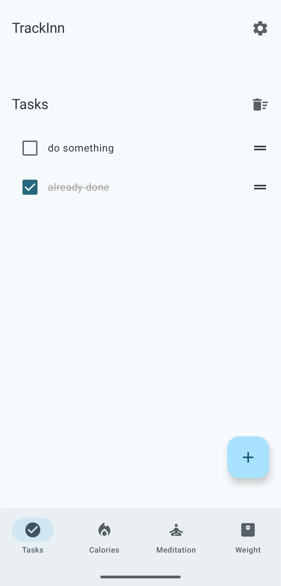
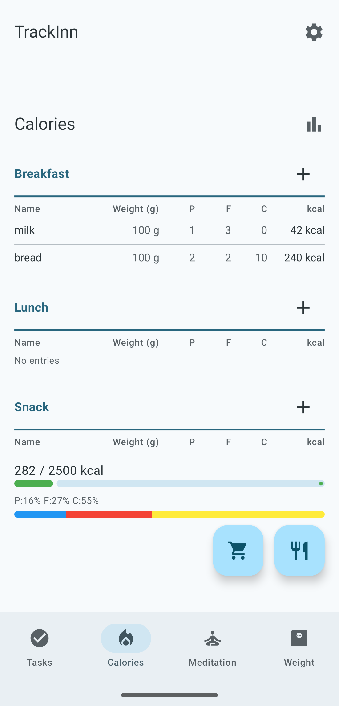
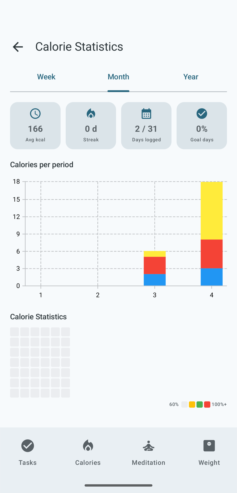
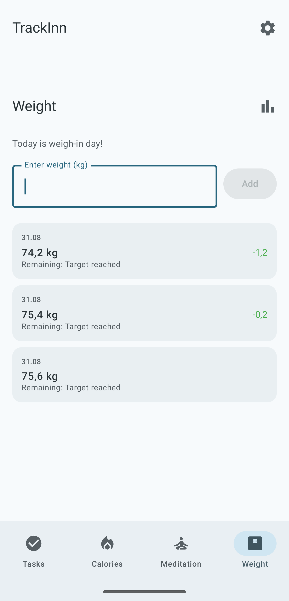
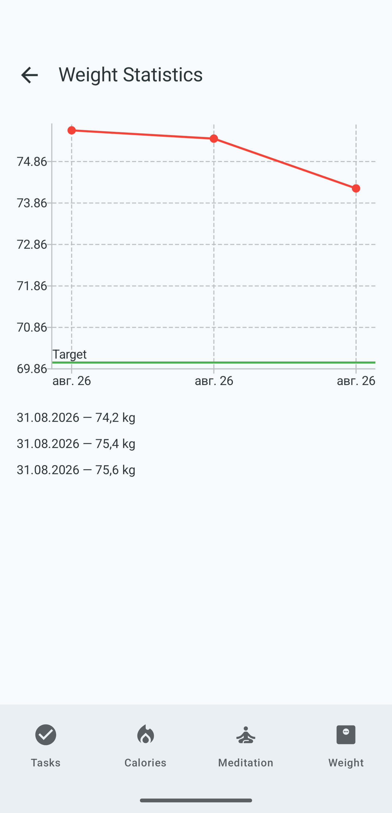
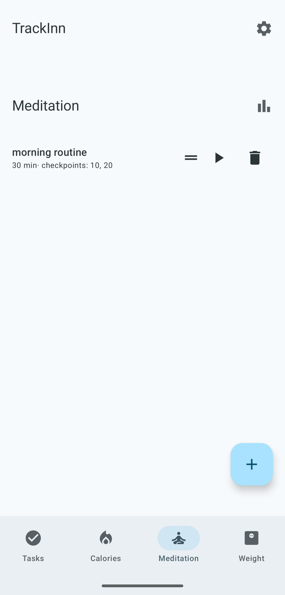
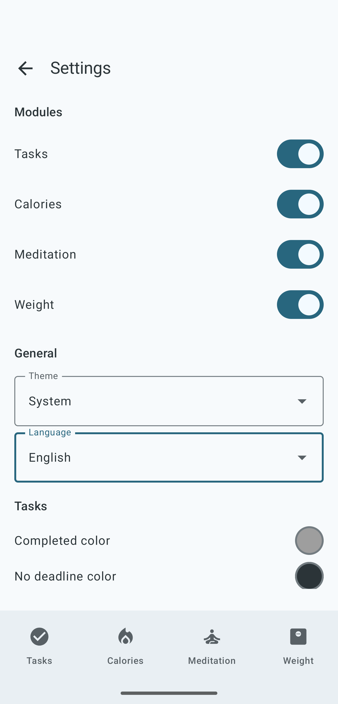
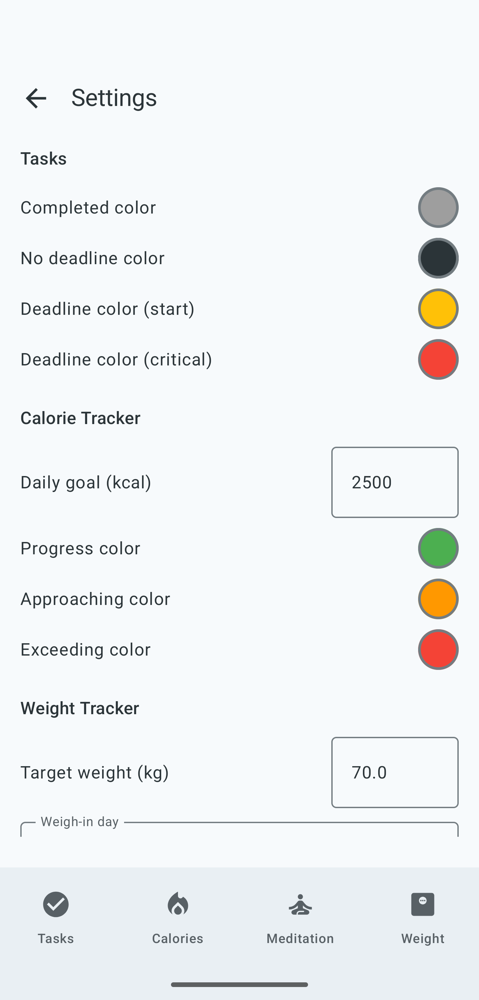

# TrackInn


TrackInn is an offline-first Android app that combines a task tracker, calorie counter, meditation timer, and weight tracker into a single interface. No accounts, no cloud sync — everything stays on your device.

## What it does

TrackInn is built around four independent modules that can be enabled or disabled individually. The app is fully bilingual (English and Russian) and supports light, dark, and system themes.

### Todo

A simple task list with manual ordering. Tasks can be reordered via drag-and-drop. Each task optionally has a deadline (date + time), and the text color gradually shifts from black to yellow to red as the deadline approaches. Tasks can be added to Google Calendar with one tap. A top bar provides quick access to clear all completed tasks.

### Calorie tracker

Track meals across four categories: breakfast, lunch, snack, dinner. The app maintains a local product database with per-100g nutritional values (calories, protein, fat, carbs) and supports composite dishes — recipes made of multiple ingredients with automatic calorie calculation. A built-in product editor lets you manage your food database. The daily progress bar at the bottom shows how close you are to your calorie goal, with configurable colors for normal, approaching, and exceeding states. Macro tracking (protein, fat, carbs) is displayed alongside calories. A statistics screen provides a dashboard with daily/weekly/monthly summaries, bar charts, and a GitHub-style heatmap calendar.

#### JSON product import

Products can be imported from a JSON file. The JSON must contain an array of product objects. Example:

```json
[
  {
    "name": "Chicken breast",
    "category": "Meat",
    "unit": "GRAM",
    "caloriesPer100": 165,
    "proteinPer100": 31,
    "fatPer100": 4,
    "carbsPer100": 0
  },
  {
    "name": "Rice (cooked)",
    "category": "Grains",
    "unit": "GRAM",
    "caloriesPer100": 130,
    "proteinPer100": 3,
    "fatPer100": 0,
    "carbsPer100": 28
  }
]
```

**Schema fields:**

| Field | Type | Required | Description |
|---|---|---|---|
| `name` | String | Yes | Product name |
| `category` | String | No | Category (e.g. "Meat", "Grains", "Dairy") |
| `unit` | String | No | Default unit, defaults to `"GRAM"` |
| `caloriesPer100` | Int | Yes | kcal per 100 g |
| `proteinPer100` | Int | Yes | Protein (g) per 100 g |
| `fatPer100` | Int | Yes | Fat (g) per 100 g |
| `carbsPer100` | Int | Yes | Carbs (g) per 100 g |

> Imported products are merged by name — duplicate names are skipped.

### Weight tracking

Log daily weight measurements and track your progress over time. A statistics screen with a line chart shows your weight trend. History can be reviewed and individual entries can be edited or deleted.

### Meditation timer

A configurable meditation timer with a circular progress ring and checkpoint markers. Timers support a preparation countdown, multiple checkpoints with separate sounds, and five built-in sounds (plink, bell, chime, gong, drop). Sessions are recorded to a local history with completion status and can be filtered by date range. The statistics screen includes a dashboard with key metrics (total sessions, time, streak, completion rate), weekly bar charts, and a GitHub-style heatmap calendar showing meditation intensity.

### Settings and customization

The app provides a palette of 20 Material Design colors that can be assigned to various UI elements — task deadlines, calorie progress, meditation rings. Modules can be toggled on or off; when disabling a module, the app warns and offers to wipe its history. All data can be exported to and imported from JSON.

## Installation

1. Download the latest `.apk` from [Releases](https://github.com/drsdgdbye/trackinn/releases/latest)
2. On your device, enable **Unknown sources** in security settings
3. Disable **Play Protect** scanning (the APK is self-signed, so Play Protect will block installation)
4. Install the APK

> Publication in Google Play Store is in progress.

## Screenshots

### Todo

<p align="center">
  
</p>

### Calorie tracker

<p align="center">
  
  
</p>

### Weight tracking

<p align="center">
  
  
</p>

### Meditation timer

<p align="center">
  
</p>

### Settings

<p align="center">
  
  
</p>

## Tech stack

| Component | Technology |
|---|---|
| Language | Kotlin |
| UI | Jetpack Compose + Material 3 |
| Database | Room |
| Preferences | DataStore |
| Navigation | Navigation Compose |
| Drag-and-drop | sh.calvin.reorderable |
| Charts | Vico |
| Annotation processing | KSP |

## License

This project is licensed under the [WTFPL](https://www.wtfpl.net/).
